# The pipeline

<!-- GENERATED by `npm run diagram` — do not edit by hand. CI fails if this file is stale. -->

Every node below is derived from a file that has to exist for the pipeline to work:
workflows and their triggers, hooks from `.claude/settings.json`, skills, subagents, and
`bands.yaml`. Nothing here is a hand-kept list, so this diagram cannot describe a pipeline
that is not there.

What the repository cannot state about itself — which stage a thing belongs to, whether it
costs quota, which node is a gate — lives in `scripts/diagram/annotations.json`, and
`npm run diagram` refuses to run if any derived node lacks an entry.

```mermaid
flowchart LR
  subgraph S1["1 · Plan"]
    direction TB
    dec_intent{"accept the intent"}
    wf_agent_intent[["Agent — draft intent<br/><small>▸ issue labelled</small>"]]
    skill_intent["intent<br/><small>▸ /intent, or the intent agent</small>"]
  end
  subgraph S2["2 · Design"]
    direction TB
    dec_spec{"accept the spec"}
    skill_sdlc["sdlc<br/><small>▸ /sdlc <id>, or --auto</small>"]
    skill_spec["spec<br/><small>▸ /spec, after an intent</small>"]
  end
  subgraph S3["3 · Build"]
    direction TB
    dec_plan{"accept the plan"}
    wf_claude[["Claude Code<br/><small>▸ @claude mention · issue opened</small>"]]
    skill_house_style["house-style<br/><small>▸ auto — any edit under site/</small>"]
    agent_simplifier(["simplifier<br/><small>▸ asked, before opening a PR</small>"])
    svc_claude>"Claude (Pro quota)<br/><small>▸ every agent run, local and CI</small>"]
  end
  subgraph S4["4 · Test"]
    direction TB
    wf_checks[["Checks<br/><small>▸ push to main · pull request</small>"]]
    wf_security[["Security<br/><small>▸ cron · manual · pull request</small>"]]
    wf_verify[["Verify<br/><small>▸ push to main · pull request</small>"]]
    agent_verifier(["verifier<br/><small>▸ asked, before claiming done</small>"])
  end
  subgraph S5["5 · Deploy"]
    direction TB
    dec_merge{"approve + merge the PR"}
    dec_deploy{"approve the deployment"}
    wf_claude_code_review[["Claude Code Review<br/><small>▸ pull request</small>"]]
    wf_deploy[["Deploy<br/><small>▸ push to main · manual</small>"]]
    wf_preview[["Preview<br/><small>▸ pull request</small>"]]
    env_production{{"production<br/><small>▸ deploy.yml — waits for a human</small>"}}
    env_preview{{"preview<br/><small>▸ preview.yml — no approval</small>"}}
    skill_ship["ship<br/><small>▸ /ship, once verify passes</small>"]
    svc_ftp>"FTP host rashid.fr<br/><small>▸ preview and deploy jobs only</small>"]
  end
  subgraph S6["6 · Maintain"]
    direction TB
    dec_triage{"triage: apply `intent`"}
    wf_bands[["Control bands<br/><small>▸ cron · manual</small>"]]
    wf_digest[["SDLC digest<br/><small>▸ cron · manual</small>"]]
    svc_slack>"Slack<br/><small>▸ deploy done · band breached</small>"]
  end
  subgraph HOOKS["Hooks · deterministic, not negotiable"]
    direction TB
    hook_protect_guardrails[/"protect-guardrails<br/><small>▸ PreToolUse(Write|Edit|MultiEdit|NotebookEdit)</small>"/]
    hook_protect_approved[/"protect-approved<br/><small>▸ PreToolUse(Write|Edit|MultiEdit|NotebookEdit)</small>"/]
    hook_guard_bash[/"guard-bash<br/><small>▸ PreToolUse(Bash)</small>"/]
    hook_format[/"format<br/><small>▸ PostToolUse(Write|Edit|MultiEdit)</small>"/]
    hook_audit[/"audit<br/><small>▸ PostToolUse(Write|Edit|MultiEdit)</small>"/]
  end
  S1 --> S2
  S2 --> S3
  S3 --> S4
  S4 --> S5
  S5 --> S6
  S6 -. "a breach becomes the next intent<br/>no tokens, no model" .-> S1
  classDef human fill:none,stroke:#e20074,stroke-width:2px,color:#e20074;
  classDef gate fill:none,stroke:#e20074,stroke-width:2px;
  classDef agent stroke:#315aa1,stroke-width:1.5px;
  class dec_intent,dec_spec,dec_plan,dec_merge,dec_deploy,dec_triage human;
  class env_production gate;
  class wf_agent_intent,wf_claude_code_review,wf_claude agent;
```

## Reading it

- **Pink** marks a human decision or the production gate. Nothing else is pink.
- **▸** is what triggers a thing, not what it does.
- 10 workflows, 2 environments, 5 hooks, 5 skills, 2 subagents, 3 services.
- 3 of them spend Claude quota: `Agent — draft intent`, `Claude Code Review`, `Claude Code`. Everything else is free.

A rendered SVG of the same model, themed for light and dark, is on
[the site](https://rashid.fr/sdlc/#pipeline).
